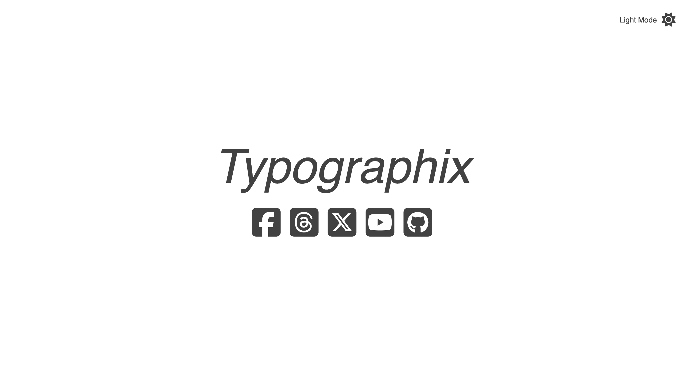
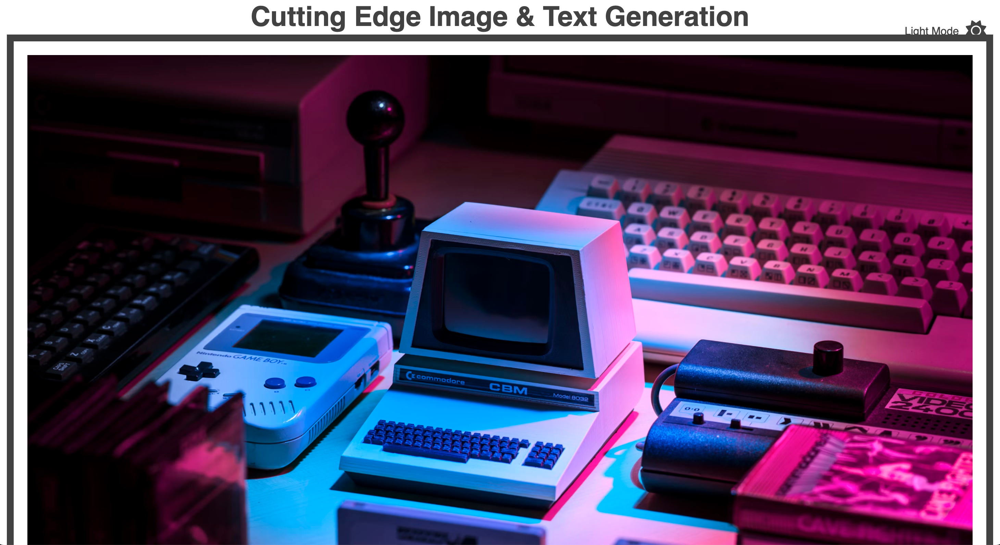
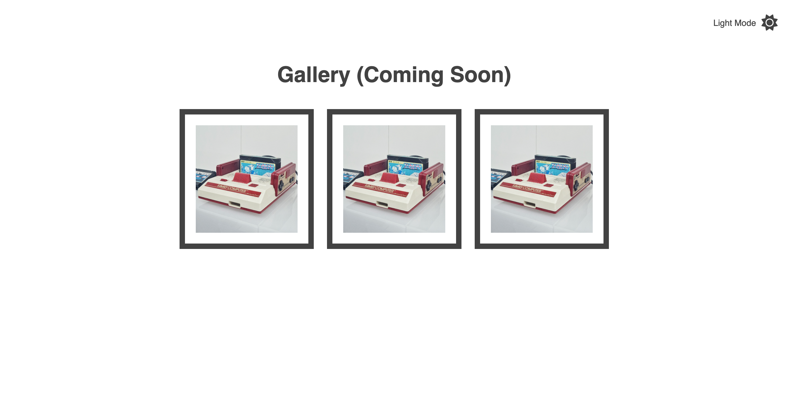
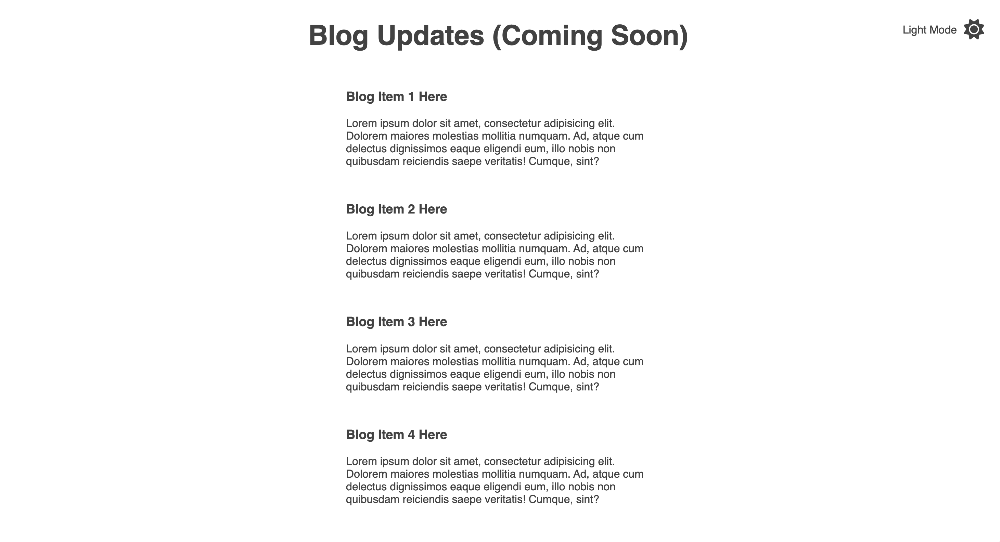
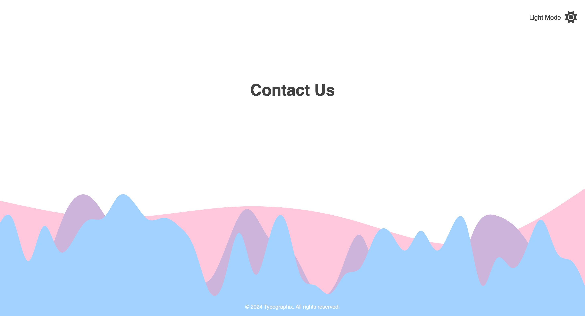
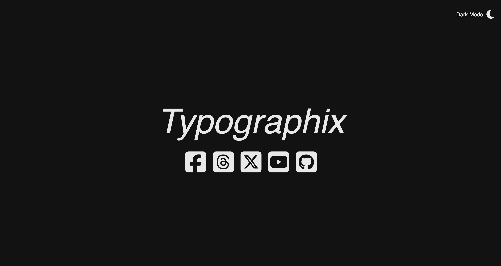

# Project Overview
This is a code-along project from the Zero to Mastery CSS course. It is a minimalist landing page for a company. This is not the final version of this project; it is merely a starting point as I work on sharpening my CSS skills. 

This code is not my original design, but it is something I have learned quite a bit of design and CSS skills as I've worked on it.

I used the following technologies for this project:

* Visual Studio Code
* WebStorm
* CSS
* HTML
* Git
* JavaScript
## Version
v3
## Features
* Google fonts
* Font Awesome
* CSS Animation for icons and text
* Image Gallery
* Light/Dark Mode
## Current Design
### Full Design

### Dark Mode

